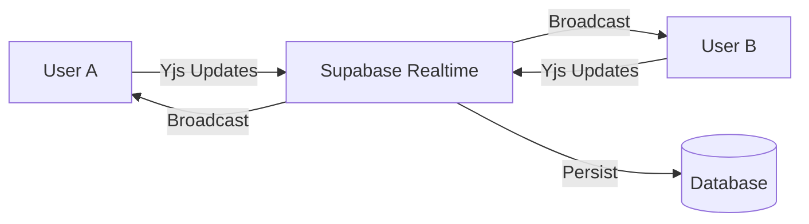

# Real-time Collaboration - Technical Planning

## Overview

This document outlines the technical plan for implementing real-time collaborative editing in Syrealize. This is a complex feature that requires careful architecture to ensure reliable synchronization and conflict resolution.

## Proposed Architecture

### Technology Stack

| Component | Technology | Rationale |
|-----------|------------|-----------|
| Presence/Cursors | Supabase Realtime | Built-in, low latency, handles connection state |
| Document Sync | Yjs + Supabase Provider | CRDT-based, handles offline, proven in production |
| Rich Text | Milkdown + Y.js integration | Already using Milkdown, Y.js compatible |
| Awareness | Yjs Awareness Protocol | Standard for cursor/selection sync |

### Data Flow



## Core Components

### 1. Collaboration Provider

```typescript
// lib/collaboration/CollaborationProvider.tsx
interface CollaborationContext {
  doc: Y.Doc
  provider: SupabaseProvider
  awareness: Awareness
  isConnected: boolean
  collaborators: Collaborator[]
}
```

### 2. Cursor Rendering

```typescript
// components/CollaboratorCursor.tsx
interface Collaborator {
  id: string
  name: string
  color: string
  cursor: { x: number, y: number } | null
  selection: { anchor: number, head: number } | null
}
```

### 3. Presence Indicators

- Avatar stack in toolbar showing active editors
- Colored cursors matching user avatars
- Selection highlighting with user colors
- "User is typing..." indicators

## Database Schema

```sql
-- Collaboration sessions
CREATE TABLE collaboration_sessions (
  id UUID PRIMARY KEY,
  post_id UUID REFERENCES posts(id),
  created_at TIMESTAMPTZ DEFAULT now(),
  last_activity TIMESTAMPTZ DEFAULT now()
);

-- Active collaborators
CREATE TABLE collaborators (
  id UUID PRIMARY KEY,
  session_id UUID REFERENCES collaboration_sessions(id),
  user_id UUID REFERENCES users(id),
  joined_at TIMESTAMPTZ DEFAULT now(),
  cursor_position JSONB,
  is_active BOOLEAN DEFAULT true
);
```

## Implementation Phases

### Phase 1: Presence (MVP)
- [ ] Show who's viewing a post
- [ ] "Currently editing" indicator
- [ ] Real-time viewer count

### Phase 2: Cursor Sync
- [ ] Real-time cursor positions
- [ ] User color assignment
- [ ] Cursor labels with names

### Phase 3: Collaborative Editing
- [ ] Y.js document integration
- [ ] Conflict resolution
- [ ] Undo/redo with attribution

### Phase 4: Polish
- [ ] Offline support
- [ ] Version history integration
- [ ] Comments on selections

## Dependencies Required

```json
{
  "yjs": "^13.6.0",
  "@supabase/realtime-js": "latest",
  "y-prosemirror": "^1.2.0"
}
```

## Security Considerations

1. **Authorization**: Only invited collaborators can join sessions
2. **Rate Limiting**: Prevent update flooding
3. **Encryption**: End-to-end for sensitive content
4. **Audit Trail**: Log all document changes

## Estimated Effort

| Phase | Complexity | Effort |
|-------|------------|--------|
| Presence | Low | 3-5 days |
| Cursor Sync | Medium | 5-7 days |
| Collaborative Editing | High | 2-3 weeks |
| Polish | Medium | 1 week |

**Total: 4-6 weeks**

## Risks & Mitigations

| Risk | Mitigation |
|------|------------|
| Merge conflicts | Use CRDTs (Yjs) for automatic resolution |
| Network latency | Optimistic updates, local-first approach |
| Data loss | Auto-save, version history, undo stack |
| Scaling | Supabase Realtime handles broadcasting |

## Recommended Next Steps

1. **Prototype Presence**: Start with simple "who's viewing" feature
2. **Evaluate Y.js**: Build a proof-of-concept with Milkdown integration
3. **User Research**: Understand collaboration patterns for researchers
4. **Incremental Rollout**: Feature flag for beta testers

---

*This is a planning document. Implementation will be done in a future sprint.*
